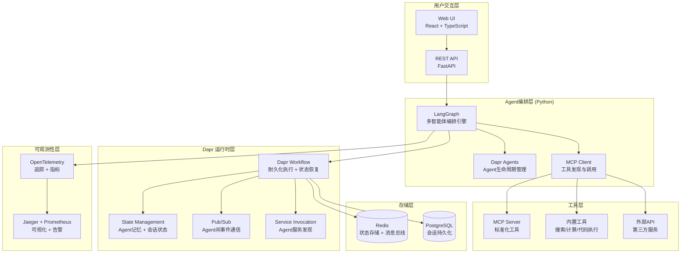

## 第一部分：选题填表

| **类别** | **编号** | **题目** | **限报** | **要求** | **需求概述** | **担任角色** | **建议方案** | **建议语言** | **成果形式** |
|:---:|:---:|:---|:---:|:---:|:---|:---|:---|:---:|:---|
| **2026软件新架构** | 15 | **AI Native多智能体协作平台** | 4 | | 构建基于LangGraph的多智能体协作平台，实现Agent间任务分配、协作执行与持久化编排。嵌入Dapr运行时提供状态管理、服务调用、发布订阅和Durable Workflow能力，支持多模型接入（OpenAI/Claude/Ollama）、MCP工具集成和全链路可观测。核心功能：任务规划与分解、多Agent角色协作、工作流断点续传、智能体记忆管理、Agent沙箱隔离。平台提供REST API和Web可视化界面，支持Agent团队的动态编排和水平扩展。| 架构师，后端，算法 | **核心框架**：LangGraph 1.1+ + Dapr Agents 1.0.6；**AI模型**：Ollama本地部署 / OpenAI API；**运行时**：Dapr 1.17+ + Dapr Workflows；**工具集成**：MCP Server SDK；**前端**：React + Vite + TailwindCSS；**存储**：Redis + PostgreSQL；**可观测性**：OpenTelemetry + Jaeger + Prometheus；**部署**：Docker + Dapr CLI，提供一键启动脚本。 | Python + TypeScript | 系统、开发报告 |

## 第二部分：完整设计方案与开发思路（2周版）

### 一、选题背景与价值定位

2026年是Agentic AI（智能体型AI）的爆发之年。2025年，LangGraph发布1.0正式版，OpenAI推出Agents SDK，CrewAI社区突破10万认证开发者，AG2从微软AutoGen独立成为开源AgentOS。到2026年初，Agent框架市场格局已基本清晰，LangGraph、CrewAI、AutoGen等主流框架各自形成了鲜明的架构模式。

与此同时，云原生与AI开始从简单的“叠加走向一体化”。CNCF旗舰大会2026年的议题明确传递了“AI基础设施、Agent系统、云原生OS”三大方向，行业共识正在从Cloud Native迈向AI Native。Kubernetes不再只是微服务的平台，在2026年将越来越多地承载Agent型工作负载，平台工程师需要重新思考如何构建、部署和运维AI Agent。

在这个背景下，Dapr在2026年3月正式发布了Dapr Agents 1.0，这是一个用Python构建的、基于Dapr分布式系统能力的生产级框架，提供持久化执行、可插拔记忆、统一LLM接入等关键能力。与此同时，Dapr提供了与主流Agent框架的一流集成方案。Dapr通过Workflow引擎为Agent提供耐久化执行能力——所有Agent与LLM的交互和工具调用都会持久化到状态存储，即使Agent进程重启也能从中断点继续执行。

本项目的核心价值在于：让学生在2周内构建一个集当前最前沿技术于一身的AI Native多智能体协作平台，掌握Agent框架与Dapr运行时融合的全栈工程能力，体验2026年AI原生架构的核心范式——当Agent从“一次性执行”走向“持久化、可观测、可恢复”的生产级系统时，传统的K8s+容器模式叠加Agent编排层的价值闭环才真正形成。

### 二、系统架构设计

### 三、核心功能模块设计（2周可完成）

#### 模块1：Agent框架选择与编排引擎

2026年OSS Agent框架已形成清晰的架构分类，各有鲜明定位：LangGraph适用于状态化多智能体工作流，通过图节点和共享状态实现精确控制；CrewAI面向基于角色的Agent团队，提供开箱即用的多角色协作抽象；AutoGen（由AG2继续演进）基于对话式多智能体，适合需要多轮协商的复杂任务；AGNO专注轻量级生产Agent，拥有最小的运行时开销。

本方案采用LangGraph编排模式：

- **LangGraph模式**：将Agent工作流建模为有向图（nodes = actions, edges = transitions），通过Checkpoint机制保存每个节点执行后的状态快照，适合需要精细控制的长时间运行任务

**任务规划与分解**：用户输入复杂自然语言请求后，编排引擎调用LLM进行分析与任务分解，根据任务类型自动选择编排模式，将大任务拆解为多个子任务并分配给对应的Agent执行。

#### 模块2：Dapr Agent持久化集成

这是本项目的核心技术亮点。Dapr为Agent框架提供了三个层面的增强：

- **持久化执行**：通过Dapr Workflow引擎运Agent任务。所有Agent与LLM的交互、工具调用和决策过程都会持久化到状态存储中。即使Worker Pod崩溃或重启，Agent任务也能从中断点恢复继续执行，实现Exactly-Once语义
- **可插拔Agent记忆**：使用Dapr State Management API管理Agent的短期记忆（会话上下文）和长期记忆（跨会话的知识积累）。支持超过30种状态存储后端（Redis、PostgreSQL等），Agent可在运行时无缝切换记忆存储
- **Agent间可靠通信**：通过Dapr Pub/Sub实现安全的事件驱动式多智能体协作。支持至少一次消息传递保证，并可观察其执行

Dapr Agents 1.0还提供持久化的Workflow恢复能力——Agent Workflow的每一次检查点都会持久化，故障后从最后一个已知状态继续，实现应用层高可用。

Dapr Agents 1.0.6 已引入，OpenTelemetry SDK 固定为 1.39.1 以满足其语义约定约束（详见 ADR-004）。

#### 模块3：MCP工具集成

实现Model Context Protocol标准化的工具接入：
- **工具注册**：MCP Server按标准格式暴露工具（名称、描述、JSON Schema定义）
- **动态发现**：Agent运行时发现可用工具，根据LLM识别的任务需求自动选择合适的工具
- **工具执行**：通过Dapr Service Invocation安全调用外部工具，支持超时和重试
- **示例工具集**：实现计算器（数学表达式求值）、网络搜索（调用公开搜索API）、代码执行（Python/Shell在沙箱中运行）、数据库查询（只读SQL查询）等至少4个内置工具

#### 模块4：智能体记忆管理

- **会话记忆**：每个用户的独立会话历史存储到Redis，支持多轮对话上下文继承
- **长期记忆**：Agent可记忆用户偏好和历史交互模式，通过向量数据库（可选）进行语义检索
- **工作流状态记忆**：LangGraph的Checkpoint机制与Dapr State Management集成，实现任务级的断点续传

#### 模块5：可观测性

- **分布式追踪**：使用OpenTelemetry SDK自动为Agent调用链路生成Span，集成Jaeger展示完整的Agent推理和工具调用过程
- **指标收集**：通过Prometheus导出Agent执行指标，包括任务完成率、平均执行时间、模型调用Token消耗、工具调用成功率
- **行为追踪**：记录Agent的ReAct循环（推理→行动→观察）和每次工具调用，保存在结构化日志中供审计和分析

#### 模块6：Web可视化界面

- **控制台功能**：展示Agent团队运行状态、任务执行历史、工具调用链路、Token消耗统计
- **Agent会话管理**：用户可创建新会话、查看历史对话、暂停/恢复长时间运行的Agent工作流
- **配置管理**：支持在线配置Agent角色、调整模型参数（temperature、max_tokens等）

### 四、开发路线图（2周/10个工作日）

| 阶段 | 天数 | 任务 | 输出物 |
|:---|:---|:---|:---|
| **第1-2天** | 2 | 环境搭建（Dapr CLI初始化 + Python虚拟环境）；LangGraph快速原型；对接Ollama本地模型，实现单Agent问答 | LangGraph基本Agent对话能力完成 |
| **第3-4天** | 2 | 集成Dapr Workflow与State Management；实现会话记忆持久化和Workflow状态快照 | Dapr持久化集成完成 |
| **第5-6天** | 2 | 实现多Agent编排（LangGraph多节点图）；设计示例场景（如信息收集→处理→报告的流水线） | 多Agent协作能力完成 |
| **第7-8天** | 2 | 实现MCP工具注册和调用；构建至少4个示例工具；集成可观测性（OpenTelemetry + Jaeger） | 工具生态 + 可观测性完成 |
| **第9-10天** | 2 | 开发Web UI（React + API对接）；端到端集成测试；Docker + Dapr Compose部署；撰写项目报告 | 完整交付 + 部署演示 |

### 五、技术挑战与解决策略

| 挑战 | 解决策略 |
|:---|:---|
| Dapr与Agent框架的集成复杂度 | 聚焦核心集成场景（持久化 + 状态管理），暂不深入Service Invocation和Actor模型；从单Agent模式起步，再扩展到多Agent |
| 编排框架选择 | 固定使用LangGraph，不引入CrewAI，集中深度实现完整工作流编排 |
| LLM API调用成本和延迟 | 优先使用Ollama本地部署小模型（Qwen2.5-Coder 7B量化版），降低延迟和成本；使用OpenAI作为备选方案 |
| 多Agent状态一致性的管理 | Dapr Workflow自动维护状态快照，无需手动同步；Workflow引擎保证状态变更在持久化后才推进下一步 |
| 工具调用的安全性 | 对代码执行等敏感工具实现沙箱隔离（Docker容器或Wasm运行时），限制系统资源访问和网络权限 |

### 六、验证与演示方案

**功能验证**：
1. **单Agent演示**：用户输入“分析一篇技术文章的核心要点”，验证Agent能正确理解意图、调用搜索引擎或文档处理工具、生成结构化输出
2. **多Agent协作演示**：设计一个“信息收集→数据分析→报告生成”的三步场景，验证不同角色的Agent协作完成
3. **故障恢复演示**：在执行中手动停止Agent服务，重启后验证Workflow从断点恢复继续执行，任务成功完成且状态无丢失

**性能测试**：
- Workflow恢复时间：模拟Pod崩溃后重启，测量恢复耗时（目标 < 5秒）
- Agent并发能力：使用`locust`或`hey`模拟10个并发会话，测量服务稳定性和延迟
- Token效率监控：通过Prometheus监控Agent每次调用的Token消耗，对比不同模型（Ollama vs OpenAI）下的Token效率

### 七、拓展方向（两周后可选的完善）

- **GraphAgent工作流编排**：将LangGraph的图式工作流与Dapr Workflow结合，实现多步骤决策路径的可视化编排，支持人类在环（Human-in-the-Loop）审批节点
- **Agent沙箱隔离**：通过Wasmtime将Agent工具执行环境迁移到WebAssembly沙箱中运行，提供更严格的安全边界，参考Higress Wasm扩展模式
- **多模态扩展**：增加语音转文本、图像识别等能力，将大语言模型的文本对话扩展到多模态交互
- **Kubernetes部署**：使用Dapr + K8s Operator实现Agent的自动弹性伸缩，参考Dapr Agent的Kubernetes Native部署模式

### 八、成果形式

- 源代码仓库（GitHub），包含完整README.md（环境配置、Dapr初始化、启动说明、API文档）
- Docker + Dapr Compose编排文件，一键启动完整系统（含Agent服务 + Dapr Sidecar + Redis + PostgreSQL + Jaeger）
- Web可视化控制台，实时展示多Agent协作过程、调用链路和执行轨迹
- 项目设计报告（需求分析、架构设计、核心模块说明、测试验证结果）
