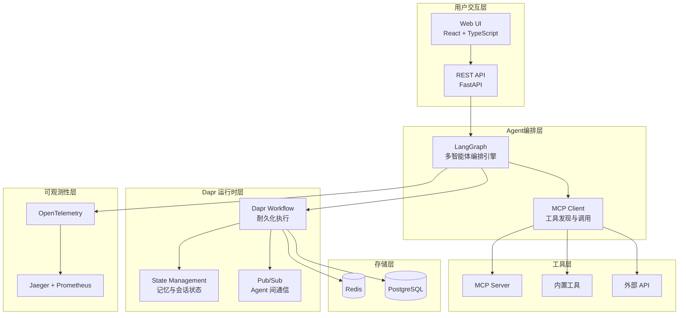

# 架构文档

本文件是设计文档的技术化拆解，所有模块以 [15 AI Native多智能体协作平台.md](15 AI Native多智能体协作平台.md) 为事实源。

## 分层架构

## 模块划分

| 模块 | 职责 | 代码目录 |
| --- | --- | --- |
| 编排引擎 | LangGraph 图、任务规划与分解 | `app/orchestration` |
| Agent 定义 | Agent 角色、团队与生命周期 | `app/agents` |
| Dapr 集成 | Workflow、State、Pub/Sub | `app/workflows`、`app/core` |
| MCP 工具 | 工具注册、发现与调用 | `app/mcp` |
| 内置工具 | 计算器、搜索、代码执行、SQL | `app/tools` |
| 沙箱隔离 | 敏感工具执行边界 | `app/sandbox` |
| 记忆管理 | 会话、长期与工作流状态记忆 | `app/memory` |
| 可观测性 | 追踪、指标、行为日志 | `app/observability` |
| REST API | 会话、Agent、工作流、配置 | `app/api` |
| Web UI | 控制台、会话管理、配置管理 | `frontend` |

编排引擎里有**两条并列链路**（ADR-019，详见 `doc/orchestration.md`）：

| 模式 | 图 | 状态 | Workflow |
| --- | --- | --- | --- |
| `static`（默认） | `app/orchestration/pipeline_graph.py` | `PipelineState` | `agent_pipeline` |
| `dynamic` | `app/orchestration/dynamic_graph.py` | `DynamicPipelineState` | `agent_dynamic` |

两者共用角色定义、工具契约、观测接入点与终态回写活动；差异只在「谁决定参与角色与顺序」。

## 架构决策

- 编排框架固定为 LangGraph，不引入 CrewAI。
- Dapr Agents 1.0.6 已引入，使用 OpenTelemetry 1.39.1 以兼容其语义约定约束；
  持久化执行由 Dapr Workflow（`dapr.ext.workflow`）承载，`dapr_agents` 高层抽象的
  使用边界见 ADR-020。
- 从单 Agent 模式起步，再扩展多 Agent 协作。
- 优先集成持久化执行与状态管理。
- 敏感工具执行必须沙箱隔离。
- 动态编排**并列新增**，默认关闭（`AGENT_ORCHESTRATION_MODE=static`），静态链路零改动（ADR-019）。
- 运行期可改的配置只覆盖业务参数（模型、路由、工具登记）；安全边界（沙箱限额）只读（ADR-020）。
