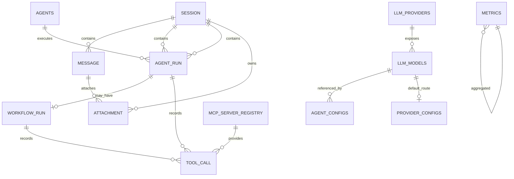

# 数据模型（开发基线）

> 本文档将原“数据模型规划”细化为可指导 SQLAlchemy 模型与 Redis 结构落地的开发基线。
> 实际落地后以模型代码为准，结构变化需同步更新本文件。

## 1. 通用约定

- PostgreSQL 16，表名小写下划线，主键默认 `UUID DEFAULT gen_random_uuid()`。
- 时间统一 `TIMESTAMPTZ`，写入 UTC。
- 状态字段统一字符串类型，并配合应用层枚举约束（不再使用 CHECK 强约束，避免演进成本）。
- JSONB 用于保存结构化载荷（checkpoint、labels、工具调用输入输出）。
- Redis 只承担缓存与高频状态；PostgreSQL 是会话、审计与持久化记录的最终事实源。

## 2. 对象关系

说明：

- 一次用户消息产生一个 `agent_runs`（可关联 `workflow_runs`）。
- `ATTACHMENT` 的两个外键都可空（草稿态上传、尚未发出的附件），见 §3.2。
- `tool_calls.run_id` 指向触发该工具调用的 `agent_runs.id`；若由 Dapr Workflow 活动直接产生，
  同一记录再冗余 `workflow_runs.id` 到 `workflow_run_id`。
- `workflow_runs.agent_run_id` 为可空唯一外键：AgentRun 不一定需要 Dapr Workflow。
- `llm_models` → `agent_configs` / `provider_configs` 的引用是**逻辑**引用（列值，不建外键）：
  删除模型条目不应阻断配置读取，悬空引用按「未绑定」处理并逐字段回退（ADR-017）。

## 3. PostgreSQL 表结构

### sessions（会话）

| 字段 | 类型 | 约束/默认 | 说明 |
| --- | --- | --- | --- |
| id | UUID | PK | 会话 ID |
| user_id | TEXT | NULL | 预留用户标识，本期无鉴权可为空 |
| status | VARCHAR(20) | `active` | `active` / `paused` |
| created_at | TIMESTAMPTZ | `now()` | 创建时间 |
| updated_at | TIMESTAMPTZ | `now()` | 更新时间 |

索引：`idx_sessions_user_id (user_id)`。

**生命周期不变量**：会话在首条消息提交时才创建（`doc/api.md` §4.2 的调用时机），因此正常
链路上**不应存在一条没有任何 `messages` 的 `sessions` 行**；历史列表（§5.13）面向的就是
这些「真正产生过消息」的会话。绕过前端直接建会话留下的无消息行属于脏数据，可安全删除
（它们没有 `agent_runs` / `workflow_runs` 依赖）。

接口层对上述不变量做兜底：`GET /api/v1/sessions` 只返回**至少有一条 `messages`** 的会话
（`items` 与 `total` 同条件过滤），`doc/api.md` §5.13。因此即使有人只用 `POST /sessions`
造行，历史列表也不会被空会话污染。

### messages（消息历史）

| 字段 | 类型 | 约束/默认 | 说明 |
| --- | --- | --- | --- |
| id | UUID | PK | 消息 ID |
| session_id | UUID | FK → sessions.id，CASCADE | 所属会话 |
| role | VARCHAR(20) | 非空 | `user` / `assistant` / `system` / `tool` |
| content | TEXT | 非空 | 消息内容 |
| agent_run_id | UUID | FK → agent_runs.id，NULL | 触发该消息的执行记录 |
| status | VARCHAR(20) | `queued` | `queued` / `running` / `completed` / `failed` |
| created_at | TIMESTAMPTZ | `now()` | 创建时间 |

索引：`idx_messages_session_id_created (session_id, created_at DESC)`。

### agents（Agent 角色配置）

| 字段 | 类型 | 约束/默认 | 说明 |
| --- | --- | --- | --- |
| id | UUID | PK | Agent 内部 ID |
| name | VARCHAR(100) | 非空、UNIQUE | Agent 名称（展示用） |
| role | VARCHAR(50) | 非空 | 角色标识：`collector` / `analyst` / `reporter` 等 |
| model | VARCHAR(100) | 非空 | 模型名 |
| temperature | DOUBLE PRECISION | `0.2` | 模型温度 |
| created_at | TIMESTAMPTZ | `now()` | 创建时间 |
| updated_at | TIMESTAMPTZ | `now()` | 更新时间 |

### agent_runs（Agent 执行记录）

| 字段 | 类型 | 约束/默认 | 说明 |
| --- | --- | --- | --- |
| id | UUID | PK | 执行 ID |
| session_id | UUID | FK → sessions.id，CASCADE | 所属会话 |
| agent_id | UUID | FK → agents.id，NULL | 实际执行的 Agent；空表示编排层自动分工 |
| status | VARCHAR(20) | `queued` | `queued` / `running` / `paused` / `completed` / `failed` |
| created_at | TIMESTAMPTZ | `now()` | 创建时间 |
| updated_at | TIMESTAMPTZ | `now()` | 更新时间 |

索引：`idx_agent_runs_session (session_id, created_at DESC)`。

### workflow_runs（Dapr Workflow 执行记录）

| 字段 | 类型 | 约束/默认 | 说明 |
| --- | --- | --- | --- |
| id | UUID | PK | 业务侧 Workflow ID |
| agent_run_id | UUID | FK → agent_runs.id，NULL、UNIQUE | 关联的 AgentRun |
| session_id | UUID | FK → sessions.id，CASCADE | 所属会话 |
| instance_id | VARCHAR(100) | NULL | Dapr Workflow 实例 ID |
| status | VARCHAR(20) | `pending` | `pending` / `running` / `paused` / `completed` / `failed` / `cancelled` |
| checkpoint | JSONB | NULL | 最近一次进度摘要（展示/审计用，不作为恢复依据） |
| current_step | VARCHAR(100) | NULL | 当前执行阶段，如 `collect` / `analyze` / `report` |
| error | TEXT | NULL | 失败原因 |
| created_at | TIMESTAMPTZ | `now()` | 创建时间 |
| updated_at | TIMESTAMPTZ | `now()` | 更新时间 |
| completed_at | TIMESTAMPTZ | NULL | 完成/终止时间 |

索引：`idx_workflow_runs_session (session_id, created_at DESC)`、`idx_workflow_runs_instance (instance_id)`。

### tool_calls（工具调用审计）

| 字段 | 类型 | 约束/默认 | 说明 |
| --- | --- | --- | --- |
| id | UUID | PK | 调用 ID |
| run_id | UUID | FK → agent_runs.id，CASCADE | 所属 AgentRun |
| workflow_run_id | UUID | FK → workflow_runs.id，NULL | 经 Workflow 执行时的冗余关联 |
| tool_name | VARCHAR(100) | 非空 | 工具名，如 `calculator` / `web_search` |
| input | JSONB | 非空 | 工具入参 |
| output | JSONB | NULL | 工具返回 |
| status | VARCHAR(20) | `running` | `running` / `succeeded` / `failed` |
| error | TEXT | NULL | 失败原因 |
| created_at | TIMESTAMPTZ | `now()` | 创建时间 |
| updated_at | TIMESTAMPTZ | `now()` | 更新时间 |

索引：`idx_tool_calls_run (run_id, created_at)`。

### metrics（指标聚合）

| 字段 | 类型 | 约束/默认 | 说明 |
| --- | --- | --- | --- |
| id | BIGSERIAL | PK | 自增 ID |
| metric_name | VARCHAR(100) | 非空 | 指标名 |
| value | DOUBLE PRECISION | 非空 | 指标值 |
| labels | JSONB | `{}` | 标签，如 `{"model": "qwen2.5-coder:7b"}` |
| recorded_at | TIMESTAMPTZ | `now()` | 记录时间 |

索引：`idx_metrics_name_time (metric_name, recorded_at DESC)`。

建表归属：DDL 由 `app/core/checkpoint.py` 的 `MetricRecord` 模型定义，随
`init_checkpoint_schema()` 在 worker 启动时创建（与其他 `*_record` 表同一入口，
成员 B 负责）。写入方是观测采样 `app/observability/metrics.py::PostgresMetricSink`，
读取方是只读接口 `GET /api/v1/metrics`（成员 D）。采样侧**不建表**：表缺失时记一次
日志并跳过写入，`/api/v1/metrics` 返回 `availability=not_integrated`。

### agent_registry（Agent 角色目录）

| 字段 | 类型 | 约束/默认 | 说明 |
| --- | --- | --- | --- |
| id | VARCHAR(50) | PK | 角色 id：内置为 `collector` / `analyst` / `reporter`，自定义为自由 slug |
| name | VARCHAR(100) | 非空 | 展示名 |
| role | VARCHAR(50) | 非空 | 角色语义键；内置对齐流水线角色，自定义为自由文本 |
| description | TEXT | NULL | 职责说明（卡片/详情展示） |
| system_prompt | TEXT | NULL | 角色系统 Prompt（预留，本期前端不暴露编辑） |
| builtin | BOOLEAN | `false` | 内置流水线角色标记；`true` 不可删除 |
| enabled | BOOLEAN | `true` | 停用后不参与配置列表展示 |
| created_at | TIMESTAMPTZ | `now()` | 创建时间 |
| updated_at | TIMESTAMPTZ | `now()` | 更新时间 |

角色目录把「代码写死的 `_AGENT_NAMES`」提升为可增删启停的注册表（ADR-017 的
`chatModels` 同构扩展）。三个内置角色由 `init_checkpoint_schema()` 幂等种子写入；
自定义角色可自由增删，删除时连同 `agent_configs` 覆盖行一并清理。建表归属：
`app/core/checkpoint.py::AgentRegistryRecord`。写入方是 `POST/DELETE
/api/v1/config/agents`（`doc/api.md` §5.7），读取方是同接口的 GET 列表。

**与 `app/agents/roles.py` 的关系（角色定义三处来源，需保持一致）**：

1. `app/agents/roles.py::RoleDefinition`（成员 C 的静态 Prompt 层）—— 内置角色的
   `system_prompt` **唯一事实源**，同时含默认 `model` / `temperature`。流水线阶段活动
   仍从这里取角色 Prompt，本表**不取代**它。
2. `agent_registry`（本表）—— 角色目录的**可增删启停**层，负责「有哪些角色」及其
   展示名 `name` / 职责 `description` / 启停 `enabled`。内置三行的 `name` / `description`
   由 `BUILTIN_AGENT_SEED` 种子写入，**与 roles.py 的展示名保持一致**；`system_prompt`
   列本期预留为空（前端不暴露编辑），真实 Prompt 仍走 roles.py。
3. `app/api/main.py::_AGENT_NAMES` —— API 层的展示名回退 dict，仅在 `agent_registry`
   尚未种子化（旧环境未跑迁移）时兜底，**不是**事实源。

三者的内置角色 `name` 语义一致（信息收集 / 数据分析 / 报告生成）；改角色展示名或
Prompt 时需同步 roles.py 与 `BUILTIN_AGENT_SEED`，避免目录与 Prompt 层漂移。

### agent_configs（Agent 配置覆盖）

| 字段 | 类型 | 约束/默认 | 说明 |
| --- | --- | --- | --- |
| agent_id | VARCHAR(50) | PK | 角色 id，指向 `agent_registry.id`（逻辑引用，不建外键） |
| model | VARCHAR(200) | NULL | 覆盖模型名；NULL 表示回退环境配置 |
| temperature | DOUBLE PRECISION | NULL | 覆盖温度（0.0–2.0）；NULL 表示回退环境配置 |
| llm_model_id | VARCHAR(80) | NULL | 指向 `llm_models.id`；设置后由该模型条目提供端点、凭据与特化参数（ADR-017） |
| top_p | DOUBLE PRECISION | NULL | 覆盖 nucleus sampling（0.0–1.0）；NULL 表示回退 |
| max_output_tokens | INTEGER | NULL | 覆盖单次输出上限（≥1）；NULL 表示回退 |
| reasoning_type | VARCHAR(20) | NULL | 覆盖推理模式：`none` / `openai` / `gemini` / `anthropic`；NULL 表示回退 |
| updated_by | VARCHAR(100) | NULL | 审计来源，取请求头 `X-Request-ID` |
| updated_at | TIMESTAMPTZ | `now()` | 最近更新时间 |

只存**被覆盖的字段**（行内 NULL = 回退），不复制环境配置的全量快照；删除覆盖等价于把
对应列写回 NULL。建表归属：`app/core/checkpoint.py::AgentConfigRecord`，随
`init_checkpoint_schema()` 创建。写入方是 `PATCH /api/v1/config/agents/{agent_id}`
（`doc/api.md` §5.7），读取方是同接口的 GET 列表面与 Workflow 阶段活动
（`app/core/agent_config.py::resolve_agent_settings`）。索引：主键即可，无额外索引
（数据量与角色数同阶）。
`llm_model_id` 无外键约束：模型条目被删除时角色退化为「未绑定」并按 `model` 列回退，
不留悬挂引用导致的读取失败（ADR-017）。

### llm_providers（模型 Provider 注册表）

| 字段 | 类型 | 约束/默认 | 说明 |
| --- | --- | --- | --- |
| id | VARCHAR(50) | PK | 用户可读 slug，如 `gateway-main` |
| name | VARCHAR(100) | 非空 | 展示名 |
| preset_type | VARCHAR(40) | 非空 | 预设族：`openai` / `deepseek` / `moonshot` / `openrouter` / `ollama` / `openai-compatible` 等（见 §3.1） |
| api_type | VARCHAR(30) | 非空 | 协议族：`openai-compatible` / `openai-responses` / `anthropic` / `gemini` / `amazon-bedrock` |
| base_url | VARCHAR(500) | NULL | 端点；空表示用预设默认端点 |
| api_key | TEXT | NULL | 凭据；**不回传、不落日志** |
| custom_headers | JSONB | `{}` | 附加请求头 `{key: value}` |
| additional_settings | JSONB | `{}` | 预留的协议族专属配置 |
| enabled | BOOLEAN | `true` | 停用后不参与默认路由解析 |
| created_at | TIMESTAMPTZ | `now()` | 创建时间 |
| updated_at | TIMESTAMPTZ | `now()` | 更新时间 |
| updated_by | VARCHAR(100) | NULL | 审计来源 |

建表归属：`app/core/checkpoint.py::LlmProviderRecord`，随 `init_checkpoint_schema()` 创建。
写入方是 `POST/PATCH/DELETE /api/v1/config/providers`（`doc/api.md` §5.9），
读取方是 `app/core/model_registry.py`。索引：主键 + `idx_llm_providers_enabled (enabled)`。

### llm_models（模型注册表）

| 字段 | 类型 | 约束/默认 | 说明 |
| --- | --- | --- | --- |
| id | VARCHAR(80) | PK | 条目 id，批量导入时由 `provider_id` + `model` 派生 |
| provider_id | VARCHAR(50) | FK → llm_providers.id，CASCADE | 所属 Provider |
| model | VARCHAR(200) | 非空 | 调用时传给 Provider 的模型名 |
| name | VARCHAR(200) | NULL | 展示名；空则回退 `model` |
| enabled | BOOLEAN | `true` | 停用后不出现在可选模型列表 |
| reasoning_type | VARCHAR(20) | `none` | 推理模式：`none` / `openai` / `gemini` / `anthropic` |
| temperature | DOUBLE PRECISION | NULL | 特化温度（0.0–2.0）；NULL 表示用 Provider 默认 |
| top_p | DOUBLE PRECISION | NULL | 特化 nucleus sampling（0.0–1.0） |
| max_context_tokens | INTEGER | NULL | 上下文窗口上限（≥1） |
| max_output_tokens | INTEGER | NULL | 单次输出上限（≥1） |
| custom_parameters | JSONB | `[]` | 透传参数 `[{key, value, type}]`，`type` ∈ `text` / `number` / `boolean` / `json` |
| modalities | JSONB | `["text"]` | 能力标注：`text` / `vision` / `pdf` |
| created_at | TIMESTAMPTZ | `now()` | 创建时间 |
| updated_at | TIMESTAMPTZ | `now()` | 更新时间 |
| updated_by | VARCHAR(100) | NULL | 审计来源 |

唯一约束 `uq_llm_models_provider_model (provider_id, model)`：同一 Provider 下模型名唯一，
批量导入据此幂等。索引：`idx_llm_models_provider (provider_id)`。
建表归属：`app/core/checkpoint.py::LlmModelRecord`。

### mcp_server_registry（MCP Server 注册表）

| 字段 | 类型 | 约束/默认 | 说明 |
| --- | --- | --- | --- |
| id | VARCHAR(50) | PK | Server id |
| name | VARCHAR(100) | 非空 | 展示名 |
| transport | VARCHAR(20) | 非空 | `stdio` / `http` / `sse` / `ws` |
| command | VARCHAR(500) | NULL | `stdio` 可执行文件 |
| args | JSONB | `[]` | `stdio` 参数数组 |
| env | JSONB | `{}` | `stdio` 环境变量 |
| cwd | VARCHAR(500) | NULL | `stdio` 工作目录 |
| url | VARCHAR(500) | NULL | `http` / `sse` / `ws` 端点 |
| headers | JSONB | `{}` | 远程传输附加请求头 |
| enabled | BOOLEAN | `true` | 停用后不参与工具目录构建 |
| tool_options | JSONB | `{}` | 工具级选项 `{toolName: {disabled, allowAutoExecution}}` |
| discovered | JSONB | NULL | 最近一次发现缓存：`{server_info, tool_names, tool_schemas, discovered_at}` |
| created_at | TIMESTAMPTZ | `now()` | 创建时间 |
| updated_at | TIMESTAMPTZ | `now()` | 更新时间 |
| updated_by | VARCHAR(100) | NULL | 审计来源 |

建表归属：`app/core/checkpoint.py::McpServerRecord`。写入方是
`POST/PATCH/DELETE /api/v1/config/mcp/servers`（`doc/api.md` §5.11），
发现缓存由 `POST /api/v1/config/mcp/servers/{id}/discover` 写入。

### provider_configs（模型 Provider 配置）

| 字段 | 类型 | 约束/默认 | 说明 |
| --- | --- | --- | --- |
| id | VARCHAR(20) | PK | 固定 `default`（单行表，语义是「默认模型路由」） |
| provider | VARCHAR(20) | NULL | `openai` / `ollama`；NULL 表示回退环境配置 |
| model | VARCHAR(200) | NULL | 模型名；NULL 表示回退环境配置 |
| base_url | VARCHAR(500) | NULL | OpenAI 兼容端点；NULL/空表示用官方端点或回退环境配置 |
| api_key | TEXT | NULL | 凭据；**不回传、不落日志**；NULL 表示回退环境配置 |
| temperature | DOUBLE PRECISION | NULL | 温度（0.0–2.0）；NULL 表示回退环境配置 |
| default_llm_model_id | VARCHAR(80) | NULL | 默认模型条目 `llm_models.id`；设置后按该条目及其 Provider 解析路由（ADR-017） |
| updated_by | VARCHAR(100) | NULL | 审计来源，取请求头 `X-Request-ID` |
| updated_at | TIMESTAMPTZ | `now()` | 最近更新时间 |

只存**被覆盖的字段**（行内 NULL = 回退环境配置），是环境配置之上的运行期覆盖层，
不复制全量快照。建表归属：`app/core/checkpoint.py::ProviderConfigRecord`，随
`init_checkpoint_schema()` 创建。写入方是 `PUT /api/v1/config/provider`
（`doc/api.md` §5.8），读取方是 `app/core/provider_config.py`（API 与 Workflow 阶段活动
共用），合并顺序为「存储配置 → 环境配置」，见 ADR-014。索引：主键即可，恒为 1 行。
`default_llm_model_id` 是本表在 ADR-017 之后的**首选**表达：它指向注册表条目，
从而带出 Provider 端点、凭据与模型特化参数；`provider` / `model` / `base_url` / `api_key` /
`temperature` 五列保留为直连覆盖，二者同时存在时以 `default_llm_model_id` 为先。

### 3.1 Provider 预设族（preset_type）

预设族是**配置层**的概念，决定默认 `api_type`、默认端点与是否需要凭据；运行期只按
`api_type` 选择协议实现。目录定义在 `app/core/model_registry.py::PROVIDER_PRESETS`，
由 `GET /api/v1/config/provider-presets` 暴露给前端，用于 Provider 选择器与表单预填。

| 分类 | preset_type |
| --- | --- |
| 国际主流 | `openai`、`anthropic`、`gemini`、`xai`、`mistral`、`perplexity`、`groq`、`together-ai`、`cerebras` |
| 国内 | `deepseek`、`moonshot`、`zhipu`、`doubao`、`siliconflow`、`stepfun`、`minimax`、`hunyuan` |
| 聚合网关 | `openrouter`、`apimart` |
| 云托管 | `azure-openai`、`amazon-bedrock` |
| 本地 | `ollama`、`lm-studio` |
| 自定义 | `openai-compatible` |

`preset_type` 与 `api_type` 是**正交**的：同一预设族允许切换协议实现
（例如 `deepseek` 可走 `openai-compatible` 或 `anthropic`）。
`get_default_api_type_for_preset()` / `get_supported_api_types_for_preset()` 定义二者映射。

### 3.2 多模态附件（attachments）

定义在 `app/core/checkpoint.py::AttachmentRecord`，接口见 `doc/api.md` §5.16，决策见 ADR-021。

| 字段 | 类型 | 约束/默认 | 说明 |
| --- | --- | --- | --- |
| id | UUID | PK | 附件 ID |
| session_id | UUID | FK `sessions.id` `ON DELETE CASCADE`，**NULL** | 归属会话；草稿态下可为空，首条消息落库时回填 |
| message_id | UUID | FK `messages.id` `ON DELETE CASCADE`，**NULL** | 归属消息；`NULL` = 尚未发出的附件 |
| name | VARCHAR(200) | NOT NULL | 清洗后的文件名（`sanitize_name`） |
| mime | VARCHAR(120) | `''` | 登记的 MIME |
| size_bytes | INTEGER | `0` | **原始文件字节数**，不是抽取出的文本长度 |
| kind | VARCHAR(20) | NOT NULL | `image` / `text` / `document` |
| status | VARCHAR(20) | NOT NULL | `ready` / `failed`（登记成功但正文取不出来，`error` 说明原因） |
| data | BYTEA（LargeBinary） | NULL | **仅图片**保留原始字节；其余为 NULL |
| text_content | TEXT | NULL | 抽取出的正文，执行阶段读进提示词 |
| error | TEXT | NULL | `status='failed'` 时的原因 |
| created_at | TIMESTAMPTZ | `now()` | 创建时间 |

索引：`idx_attachments_message (message_id)`、`idx_attachments_session (session_id)`。

**两条不变量：**

1. **`session_id` / `message_id` 可空是故意的**。会话在首条消息提交时才创建（§3 的
   `sessions` 生命周期不变量），而用户往往先选文件再写文字，附件必须先能上传并独立存在；
   发消息时才由 `link_attachments` 回填两个外键。
2. **`link_attachments` 只认 `message_id IS NULL` 的行**。已归属别的消息的附件不会被改挂——
   请求里重复提交它会进 `unattached_attachment_ids`（部分失败），而不是把它从原消息上抢走。

**为什么放数据库而不是文件系统**：附件与消息要么同生共死（删会话就该一起没），要么就得自己
维护一套孤儿清理与卷挂载。前者由两个 `ON DELETE CASCADE` 解决，后者要动 `deploy/`。
代价是库体积，因此上传侧对单文件大小与单消息数量都有硬上限（`app/attachments/spec.py`）。
`data` 只对图片落字节（要 base64 进模型请求）；文本与文档在上传时就抽出正文，原始字节用完即弃。

## 4. Redis 结构

| Key | 类型 | TTL | 用途 | 一致性说明 |
| --- | --- | --- | --- | --- |
| `session:{id}:messages` | List（JSON 消息） | 7 天 | 会话上下文缓存 | 可丢失，PostgreSQL 为事实源 |
| `agent:{id}:memory` | Hash | 无 | 跨会话长期记忆 | 记忆层写入前先落审计 |
| `provider:config` | String（JSON） | 无 | 模型 Provider 配置缓存镜像（含密钥，见 ADR-014） | 可丢失；PostgreSQL 为唯一事实源，写成功后写缓存，未命中回源并回填 |
| `workflow:{id}:state` | Hash | 与 Workflow 生命周期一致 | Dapr State Store 状态 | 由 Dapr state store 组件管理，应用不直接改写 |
| `pubsub:agent-events` | Stream | 消息保留策略 | Agent 间事件 | Dapr Pub/Sub 管理 |

### 4.1 记忆结构明细（角色 C 定义，2026-09-08）

数据结构落地于 `app/memory/schemas.py`，读写接口契约见 `app/memory/store.py`，决策见 ADR-005。

- **会话记忆** `session:{id}:messages`：List，元素为 `SessionMessage` 的 JSON（含
  `session_id/role/content/id/agent_run_id/status/created_at`）。`role` ∈
  `user/assistant/system/tool`，`status` ∈ `queued/running/completed/failed`
  （对齐 §3 messages 表与 `doc/api.md` §2）。仅服务会话上下文读取，TTL 7 天，可丢失；
  PostgreSQL `messages` 为最终事实源，删除 Redis 不删除 PostgreSQL。
- **长期记忆** `agent:{id}:memory`：Hash，field=记忆项 key，value=JSON
  `{content, agent_id, updated_at}`（不含 key）。写前先落审计；无 TTL。
  **本期不引入向量检索**：设计文档将向量库标记为「可选」，故长期记忆为结构化偏好记录，
  后续如需语义检索再增量引入 embedding 与索引。

## 5. 一致性规则

1. 收到消息请求时，先写 `messages` + `agent_runs`（事务），再调度 Workflow；
   调度失败时 `agent_runs` 置为 `failed`。
2. Dapr Workflow 状态变更完成后回写 `workflow_runs.status`，不允许应用直接改 `instance` 侧状态。
3. Redis 消息缓存只服务会话上下文读取；删除 Redis 不删除 PostgreSQL。
4. 工具调用先插 `tool_calls(status=running)` 再执行，执行完成或失败后更新，保证审计可追踪。
5. 暂停/恢复只更新允许的状态转换，冲突状态返回错误码（见 `doc/api.md`）。
6. Workflow 终态活动在 `completed` 时追加一条 `messages(role=assistant)` 报告消息：
   ID 由 `workflow_id` 派生（uuid5），写入使用 `ON CONFLICT (id) DO NOTHING`，
   保证活动重放不产生重复消息；`failed` 时不写（见 ADR-008）。

## 6. 与既有 API 对象的关系

- `Session` ↔ `sessions`
- `Message` ↔ `messages`
- `AgentRun` ↔ `agent_runs`
- `WorkflowRun` ↔ `workflow_runs`
- `ToolCall` ↔ `tool_calls`
- `AgentInfo` / Agent 配置 ↔ `agents`
- `metrics` 接口 ↔ `metrics`
- `LlmProviderRecord` ↔ `LlmProvider`（§5.9）；`LlmModelRecord` ↔ `LlmModel`（§5.10）
- `McpServerRecord` ↔ `McpServer`（§5.11）
- Workflow 阶段活动解析生效模型时，读取链是
  `provider_configs` → `llm_providers` / `llm_models` → `agent_configs`（ADR-017 §2）。
