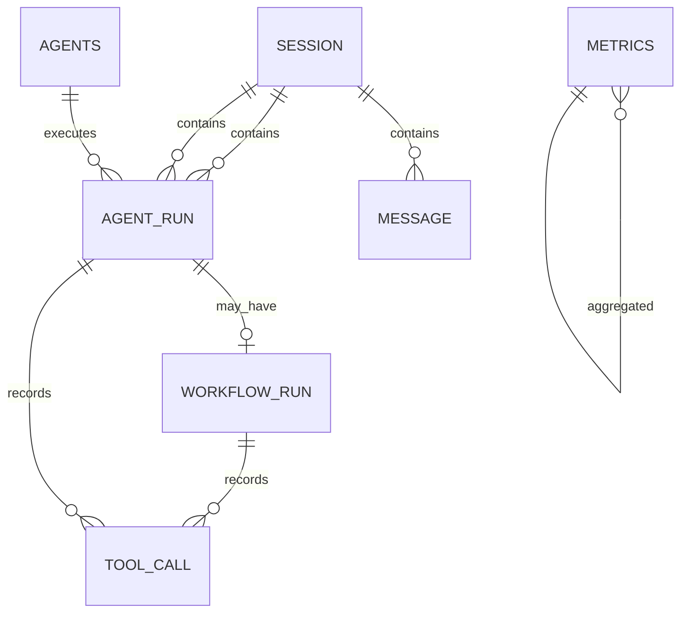

# 数据模型（开发基线）

> 本文档将原“数据模型规划”细化为可指导 SQLAlchemy 模型与 Redis 结构落地的开发基线。
> 实际落地后以模型代码为准，结构变化需同步更新本文件。

## 1. 通用约定

- PostgreSQL 16，表名小写下划线，主键默认 `UUID DEFAULT gen_random_uuid()`。
- 时间统一 `TIMESTAMPTZ`，写入 UTC。
- 状态字段统一字符串类型，并配合应用层枚举约束（不再使用 CHECK 强约束，避免演进成本）。
- JSONB 用于保存结构化载荷（checkpoint、labels、工具调用输入输出）。
- Redis 只承担缓存与高频状态；PostgreSQL 是会话、审计与持久化记录的最终事实源。

## 2. 对象关系

说明：

- 一次用户消息产生一个 `agent_runs`（可关联 `workflow_runs`）。
- `tool_calls.run_id` 指向触发该工具调用的 `agent_runs.id`；若由 Dapr Workflow 活动直接产生，
  同一记录再冗余 `workflow_runs.id` 到 `workflow_run_id`。
- `workflow_runs.agent_run_id` 为可空唯一外键：AgentRun 不一定需要 Dapr Workflow。

## 3. PostgreSQL 表结构

### sessions（会话）

| 字段 | 类型 | 约束/默认 | 说明 |
| --- | --- | --- | --- |
| id | UUID | PK | 会话 ID |
| user_id | TEXT | NULL | 预留用户标识，本期无鉴权可为空 |
| status | VARCHAR(20) | `active` | `active` / `paused` |
| created_at | TIMESTAMPTZ | `now()` | 创建时间 |
| updated_at | TIMESTAMPTZ | `now()` | 更新时间 |

索引：`idx_sessions_user_id (user_id)`。

### messages（消息历史）

| 字段 | 类型 | 约束/默认 | 说明 |
| --- | --- | --- | --- |
| id | UUID | PK | 消息 ID |
| session_id | UUID | FK → sessions.id，CASCADE | 所属会话 |
| role | VARCHAR(20) | 非空 | `user` / `assistant` / `system` / `tool` |
| content | TEXT | 非空 | 消息内容 |
| agent_run_id | UUID | FK → agent_runs.id，NULL | 触发该消息的执行记录 |
| status | VARCHAR(20) | `queued` | `queued` / `running` / `completed` / `failed` |
| created_at | TIMESTAMPTZ | `now()` | 创建时间 |

索引：`idx_messages_session_id_created (session_id, created_at DESC)`。

### agents（Agent 角色配置）

| 字段 | 类型 | 约束/默认 | 说明 |
| --- | --- | --- | --- |
| id | UUID | PK | Agent 内部 ID |
| name | VARCHAR(100) | 非空、UNIQUE | Agent 名称（展示用） |
| role | VARCHAR(50) | 非空 | 角色标识：`collector` / `analyst` / `reporter` 等 |
| model | VARCHAR(100) | 非空 | 模型名 |
| temperature | DOUBLE PRECISION | `0.2` | 模型温度 |
| created_at | TIMESTAMPTZ | `now()` | 创建时间 |
| updated_at | TIMESTAMPTZ | `now()` | 更新时间 |

### agent_runs（Agent 执行记录）

| 字段 | 类型 | 约束/默认 | 说明 |
| --- | --- | --- | --- |
| id | UUID | PK | 执行 ID |
| session_id | UUID | FK → sessions.id，CASCADE | 所属会话 |
| agent_id | UUID | FK → agents.id，NULL | 实际执行的 Agent；空表示编排层自动分工 |
| status | VARCHAR(20) | `queued` | `queued` / `running` / `paused` / `completed` / `failed` |
| created_at | TIMESTAMPTZ | `now()` | 创建时间 |
| updated_at | TIMESTAMPTZ | `now()` | 更新时间 |

索引：`idx_agent_runs_session (session_id, created_at DESC)`。

### workflow_runs（Dapr Workflow 执行记录）

| 字段 | 类型 | 约束/默认 | 说明 |
| --- | --- | --- | --- |
| id | UUID | PK | 业务侧 Workflow ID |
| agent_run_id | UUID | FK → agent_runs.id，NULL、UNIQUE | 关联的 AgentRun |
| session_id | UUID | FK → sessions.id，CASCADE | 所属会话 |
| instance_id | VARCHAR(100) | NULL | Dapr Workflow 实例 ID |
| status | VARCHAR(20) | `pending` | `pending` / `running` / `paused` / `completed` / `failed` / `cancelled` |
| checkpoint | JSONB | NULL | 最近一次进度摘要（展示/审计用，不作为恢复依据） |
| current_step | VARCHAR(100) | NULL | 当前执行阶段，如 `collect` / `analyze` / `report` |
| error | TEXT | NULL | 失败原因 |
| created_at | TIMESTAMPTZ | `now()` | 创建时间 |
| updated_at | TIMESTAMPTZ | `now()` | 更新时间 |
| completed_at | TIMESTAMPTZ | NULL | 完成/终止时间 |

索引：`idx_workflow_runs_session (session_id, created_at DESC)`、`idx_workflow_runs_instance (instance_id)`。

### tool_calls（工具调用审计）

| 字段 | 类型 | 约束/默认 | 说明 |
| --- | --- | --- | --- |
| id | UUID | PK | 调用 ID |
| run_id | UUID | FK → agent_runs.id，CASCADE | 所属 AgentRun |
| workflow_run_id | UUID | FK → workflow_runs.id，NULL | 经 Workflow 执行时的冗余关联 |
| tool_name | VARCHAR(100) | 非空 | 工具名，如 `calculator` / `web_search` |
| input | JSONB | 非空 | 工具入参 |
| output | JSONB | NULL | 工具返回 |
| status | VARCHAR(20) | `running` | `running` / `succeeded` / `failed` |
| error | TEXT | NULL | 失败原因 |
| created_at | TIMESTAMPTZ | `now()` | 创建时间 |
| updated_at | TIMESTAMPTZ | `now()` | 更新时间 |

索引：`idx_tool_calls_run (run_id, created_at)`。

### metrics（指标聚合）

| 字段 | 类型 | 约束/默认 | 说明 |
| --- | --- | --- | --- |
| id | BIGSERIAL | PK | 自增 ID |
| metric_name | VARCHAR(100) | 非空 | 指标名 |
| value | DOUBLE PRECISION | 非空 | 指标值 |
| labels | JSONB | `{}` | 标签，如 `{"model": "qwen2.5-coder:7b"}` |
| recorded_at | TIMESTAMPTZ | `now()` | 记录时间 |

索引：`idx_metrics_name_time (metric_name, recorded_at DESC)`。

## 4. Redis 结构

| Key | 类型 | TTL | 用途 | 一致性说明 |
| --- | --- | --- | --- | --- |
| `session:{id}:messages` | List（JSON 消息） | 7 天 | 会话上下文缓存 | 可丢失，PostgreSQL 为事实源 |
| `agent:{id}:memory` | Hash | 无 | 跨会话长期记忆 | 记忆层写入前先落审计 |
| `workflow:{id}:state` | Hash | 与 Workflow 生命周期一致 | Dapr State Store 状态 | 由 Dapr state store 组件管理，应用不直接改写 |
| `pubsub:agent-events` | Stream | 消息保留策略 | Agent 间事件 | Dapr Pub/Sub 管理 |

### 4.1 记忆结构明细（角色 C 定义，2026-09-08）

数据结构落地于 `app/memory/schemas.py`，读写接口契约见 `app/memory/store.py`，决策见 ADR-005。

- **会话记忆** `session:{id}:messages`：List，元素为 `SessionMessage` 的 JSON（含
  `session_id/role/content/id/agent_run_id/status/created_at`）。`role` ∈
  `user/assistant/system/tool`，`status` ∈ `queued/running/completed/failed`
  （对齐 §3 messages 表与 `doc/api.md` §2）。仅服务会话上下文读取，TTL 7 天，可丢失；
  PostgreSQL `messages` 为最终事实源，删除 Redis 不删除 PostgreSQL。
- **长期记忆** `agent:{id}:memory`：Hash，field=记忆项 key，value=JSON
  `{content, agent_id, updated_at}`（不含 key）。写前先落审计；无 TTL。
  **本期不引入向量检索**：设计文档将向量库标记为「可选」，故长期记忆为结构化偏好记录，
  后续如需语义检索再增量引入 embedding 与索引。

## 5. 一致性规则

1. 收到消息请求时，先写 `messages` + `agent_runs`（事务），再调度 Workflow；
   调度失败时 `agent_runs` 置为 `failed`。
2. Dapr Workflow 状态变更完成后回写 `workflow_runs.status`，不允许应用直接改 `instance` 侧状态。
3. Redis 消息缓存只服务会话上下文读取；删除 Redis 不删除 PostgreSQL。
4. 工具调用先插 `tool_calls(status=running)` 再执行，执行完成或失败后更新，保证审计可追踪。
5. 暂停/恢复只更新允许的状态转换，冲突状态返回错误码（见 `doc/api.md`）。
6. Workflow 终态活动在 `completed` 时追加一条 `messages(role=assistant)` 报告消息：
   ID 由 `workflow_id` 派生（uuid5），写入使用 `ON CONFLICT (id) DO NOTHING`，
   保证活动重放不产生重复消息；`failed` 时不写（见 ADR-008）。

## 6. 与既有 API 对象的关系

- `Session` ↔ `sessions`
- `Message` ↔ `messages`
- `AgentRun` ↔ `agent_runs`
- `WorkflowRun` ↔ `workflow_runs`
- `ToolCall` ↔ `tool_calls`
- `AgentInfo` / Agent 配置 ↔ `agents`
- `metrics` 接口 ↔ `metrics`
