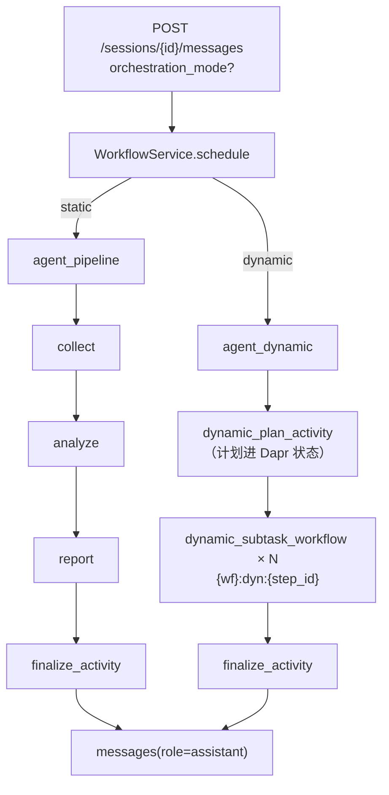
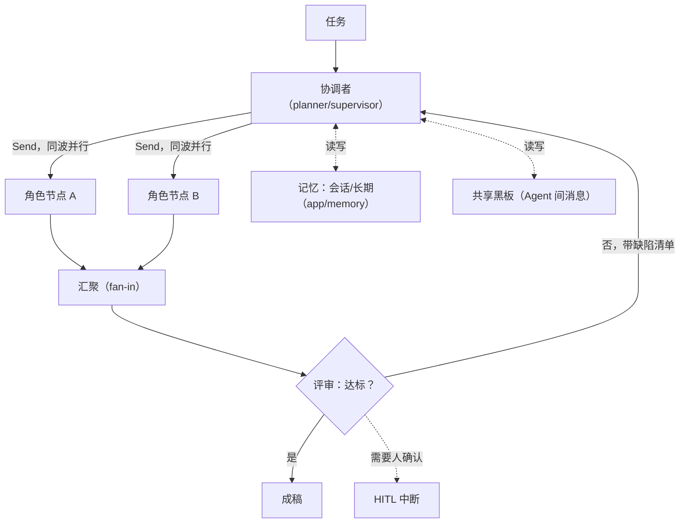

# 编排模式设计与演进

本文回答三件事：

1. 现在有哪两条编排链路，它们**各自保证什么**；
2. 动态链路怎么用、怎么降级、怎么在 Dapr 里持久化；
3. 「真·多智能体自主协作」要做什么、前置条件是什么、哪些地方会真的付代价。

决策记录：ADR-019（动态编排图）、ADR-018（视图职责）、ADR-009（工具契约）、
ADR-007（阶段活动与 Ollama）。设计事实源：`doc/15 AI Native多智能体协作平台.md` 模块 1。

---

## 1. 两条链路

| | **静态（`static`）** | **动态（`dynamic`）** |
| --- | --- | --- |
| 拓扑 | `START → collector → analyst → reporter → END` | `START → planner →（按依赖就绪度循环 execute）→ finalize → END` |
| 谁决定参与角色 | 代码里的 `PIPELINE_ROLE_ASSIGNMENT` | 规划节点（LLM）在运行期产出 |
| 状态类型 | `PipelineState`（`current_step` 单值指针） | `DynamicPipelineState`（无指针，靠 `results` 反推） |
| 同一角色能否出现多次 | 不能 | 可以 |
| 依赖表达 | 隐式（下标 -1） | 显式 `depends_on` |
| 单步失败的影响面 | 整条链失败 | 只连坐依赖它的步骤（含传递闭包） |
| Dapr 子工作流 ID | `{workflow_id}:{stage}` | `{workflow_id}:dyn:{step_id}` |
| 默认 | **是** | 否（需显式启用） |

两条链路**并列注册、并列存在**，共用同一套：

- 角色定义与 system prompt（`app/agents/roles.py`）；
- 工具契约与 ReAct 工具回填循环（`app/orchestration/tools.py`、`invoke_role_messages`）；
- 阶段观测（`app/observability/instrumentation.py::observed_stage`）；
- 终态回写活动（`app/workflows/pipeline.py::finalize_activity`）；
- 报告落库口径（ADR-008）。



---

## 2. 动态链路怎么跑

### 2.1 计划与校验

规划节点的输入是用户任务，输出要求是**严格 JSON**：

```json
{
  "rationale": "任务需要两路事实核对后再成文，因此安排两次收集。",
  "steps": [
    { "id": "s1", "role": "collector", "instruction": "收集官方文档口径", "depends_on": [] },
    { "id": "s2", "role": "collector", "instruction": "收集社区实测口径", "depends_on": [] },
    { "id": "s3", "role": "analyst",   "instruction": "对比两路口径，列出冲突点", "depends_on": ["s1", "s2"] },
    { "id": "s4", "role": "reporter",  "instruction": "生成最终报告", "depends_on": ["s3"] }
  ]
}
```

`parse_plan` 的接受条件（**全中才收，一处不合就整份丢弃**）：

| 规则 | 为什么 |
| --- | --- |
| 顶层是对象且 `steps` 非空 | 空计划等于没有计划 |
| 步骤数 ≤ `max_plan_steps`（默认 6） | 成本上限，也是「模型跑飞了」的熔断 |
| `role` ∈ `RoleId` | 未知角色没有 system prompt，跑不了 |
| `id` 非空且唯一 | `results` 的键 |
| `instruction` 非空 | 它是角色节点的用户输入 |
| `depends_on` 只引用**在它之前已声明**的 id | 一条规则同时排除自依赖、前向引用与环，不必另写环检测 |

模型输出容错：Markdown 围栏、解释性前后缀、纯 JSON 都能解析（`_extract_json` 先试整体、
再试围栏内容、最后退化为「第一个 `{` 到最后一个 `}`」）。

### 2.2 降级

规划**失败不是错误，是回退**：

| 情形 | 结果 |
| --- | --- |
| 规划模型调用抛异常 | `fallback_plan("规划模型调用失败（…），回退到固定三步流水线。")` |
| 返回内容不是可用计划 | `fallback_plan("规划模型返回的内容不是可用计划，…")` |

回退计划与静态流水线同构（`collector → analyst → reporter`），因此**用户永远拿得到报告**，
只是失去了「按任务裁剪角色」的收益。`plan_source`（`llm` / `fallback`）与 `plan_rationale`
把这次到底是「规划过」还是「降级了」写进 `workflow_runs.checkpoint`，前端与日志都能看出来。

### 2.3 调度语义

- **就绪**：某步骤的 `depends_on` 全部 `completed`，且自身尚无结果。
- **执行**：每次取就绪集合里**计划顺序最靠前**的一个（本档串行）。
- **失败**：该步记 `failed`，依赖它的步骤（含传递闭包）记 `skipped`，其余照常执行。
  只对**直接**依赖标 skipped 是不够的——`s3 → s2 → s1` 里 `s1` 失败时 `s3` 会一直停在
  `pending`，前端看起来像「还在排队」而不是「已经放弃」。
- **终态**：有计划中**最后一个成功步骤**的正文即 `completed`（`final_output`），
  否则 `failed`；失败与跳过的原因合并进 `error`。
- **工具**：与静态链路同一套注册表与 ReAct 循环，观测标签用 `stage=dyn:{step_id}`、
  `role={角色}`——`stage` 用步骤 id 而不是阶段名，因为动态模式下一次执行可以有多个同角色步骤，
  按阶段名聚合会把它们混成一条。

### 2.4 Dapr 持久化映射

| 静态 | 动态 |
| --- | --- |
| 父 Workflow 顺序调三个固定阶段的子 Workflow | 父 Workflow 先调**规划活动**，再按计划逐个调子 Workflow |
| 阶段活动 `collect_activity` / `analyze_activity` / `report_activity` | `dynamic_plan_activity` / `dynamic_step_activity` |
| `{workflow_id}:{stage}` | `{workflow_id}:dyn:{step_id}` |
| 终态回写 `finalize_activity` | **复用同一个活动**（检查点换成 `dynamic_checkpoint_summary`） |

两条硬约束：

1. **规划必须是一个活动**。规划结果进 Dapr 状态存储，重放时不会重新调用规划模型——否则
   恢复一次就得到一份新计划，续跑无从谈起。
2. **业务终态与 Dapr 终态保持一致**。没有交付物时父工作流以 `failed` 抛出，避免出现
   「工作流 `completed` 但消息 `failed`」（ADR-016 F-05 是同一类问题）。

### 2.5 启用方式

```bash
# 方式一：服务端（默认 static）
AGENT_ORCHESTRATION_MODE=dynamic      # 可选 static / dynamic
AGENT_MAX_PLAN_STEPS=6

# 方式二：单次请求覆盖（不改服务端配置）
curl -X POST .../sessions/{id}/messages \
  -H 'content-type: application/json' \
  -d '{"content":"对比两种方案的实测数据并出报告","orchestration_mode":"dynamic"}'
```

非法取值：请求体由 Pydantic `Literal` 拦成 `422`（**不静默退回 static**——「我选了动态」
却悄悄变成固定流程，比直接报错更难查）；服务端配置读到非法值时退回 `static`。

### 2.6 画布怎么消费计划

前端协作画布（ADR-018 / ADR-028）不认「拓扑」，只认 `checkpoint.plan` 的字段。
**并行与串行是算出来的，不是画死的**——这是「动态编排能被画出来」的全部依据：

| 字段 | 消费处 | 结果 |
| --- | --- | --- |
| `plan[].depends_on` | `collaboration.ts::levelOf()` | 无依赖 = 第 0 波；其余 = 「所有依赖里最深波次 + 1」 |
| 同波节点数 | `collaboration.ts::buildCollaboration()` | > 1 则该波标 `parallel`，画布横排并画「并行协作区」框 |
| 边的两端波次 | 同上 | 上游单节点 = `serial` 边；上游多节点 = 并行汇入 |
| `plan[].status` | `collaboration.ts::planStepStatus()` | `completed` / `running` / `pending` / `skipped`（**`skipped` 与 `pending` 语义相反**，不能合并） |

静态链路的 `depends_on` 是一条链，算出来是三波各一个节点；动态计划扇出时，算出来就有并行波。
**画布没有「串行节点」的专有分支**，静态链路只是它的一种输入（[ADR-030](decisions/030-multi-agent-topology-support.md)）。

一条必须知道的口径：动态链路的 `/stages` 返回 `not_integrated`（`app/api/stage_trace.py`），
所以动态画布**形状齐、详情空**——节点与并行关系来自 `plan`，每步的输入/产出/工具调用没有。

---

## 3. 档 3：真·多智能体自主协作（设计草案）

差异不在「有没有 planner」，而在**谁控制流程**：档 2 是「用 LLM 生成一份一次性计划，然后按
依赖串行执行」；档 3 是「多个 Agent 通过共享状态与消息协作，流程本身在执行中演化」。

### 3.1 目标形态



五件事，按依赖顺序：

1. **并行波次（fan-out / fan-in）**。LangGraph 的 `Send` 把同一波的就绪步骤分派到多个节点，
   汇聚节点等全部返回。前置：`DynamicPipelineState.results` 需要并发安全的合并语义
   （现在是「返回整份替换」，并行时必须改成 reducer 或按步骤键合并，否则后写的会覆盖先写的）。
2. **结果聚合**。同波结果不能只按顺序拼，要有一个**聚合策略**：拼接 / 投票 / 按角色权重合并 /
   让 LLM 归并。这一层决定「并行」是否真的比串行好，而不是把等待时间换成混乱。
3. **反思循环**。评审节点读交付物 + 验收标准，不达标就带着**具体缺陷清单**回到协调者，
   而不是无差别重跑。前置：需要**上限**（轮次与总 Token）与**收敛判据**，否则是烧钱循环。
4. **记忆接入**。`app/memory/` 目前只有 Protocol，历史消息既不落记忆也不回注 Prompt
   （`doc/roadmap.md` 记录为 F-06，仍未处置）。档 2 的步骤输入已经改成「按 `depends_on`
   标注上游」，档 3 要再往前一步：**注入会话历史与长期记忆**，并决定「注多少、怎么截断、
   怎么标注时间与来源」。
5. **Human-in-the-Loop**。Dapr Workflow 已有 `pause` / `resume`（§4.6/§4.7），但语义是
   「暂停整个实例」，不是「在某个决策点等人批准再继续」。真 HITL 需要外部事件
   （`ctx.wait_for_external_event`）+ 审批状态落库 + 前端的待办入口。

### 3.2 需要动的模块与边界

| 改动 | 模块 | 归属 |
| --- | --- | --- |
| `results` 并发合并语义（reducer / 按键合并） | `app/orchestration` | A |
| `Send` fan-out + 汇聚节点 + 聚合策略 | `app/orchestration` | A |
| 反思循环的上限与收敛判据 | `app/orchestration` | A |
| 行为日志记录评审轮次与跳步原因（不含正文，ADR-010） | `app/observability` | C |
| 记忆读写落地（会话/长期） | `app/memory` | C |
| 审批状态落库、外部事件、波次与依赖字段 | `app/core`、`app/workflows` | B |
| 波次可视化（`CollaborationGraph` 只换 `waves` 入参） | `frontend` | D |
| 待办审批入口、动态计划的只读展示 | `frontend`、`app/api` | D |

> ADR-018 已把 `CollaborationGraph` 设计成「波内并行、波间串行」的波次模型，档 3 落地时
> **视图与样式不用改**，只需把同波阶段放进同一个数组。

### 3.3 前置条件（不做会返工）

- **先有评测集**。档 2 的 `plan_source` 只能说明「有没有降级」，说明不了「动态是否比静态好」。
  在加并行与反思之前，需要一组带参考输出的任务，度量：完成率、端到端时延、Token、
  以及**动态相对静态的净收益**。没有这组数，档 3 的每一层都是猜的。
  - **首版已产出（2026-09-17）**：`scripts/orchestration_ab.py` 对 4 个任务跑静态/动态两条链路，
    量 token、调用次数、步骤数、交付物字符与「必备内容命中」，报告 `doc/evals/orchestration-ab.md`。
    它只是**小样本首版**：4 个任务、单轮采样、必备内容是弱判据。档 3 需要的是更大、更贴近真实
    业务的用例集与**参考输出**，现在还没有。
  - 顺带量到的环境约束：本机网关在连续请求下会节流（紧接着上次请求结束就发下一次必失败），
    两个评测脚本都做了「强制间隔 + 只对报错重试」，并把等待与模型纯耗时分开记——
    否则量到的是限流不是编排。见 `doc/testing.md` §4.5 第 6 条。
- **成本闸门优先于能力**。并行波次与反思循环都会放大 Token；`max_plan_steps` 现在是唯一
  上限，档 3 至少要加「单次执行的 Token/轮次预算」并在超预算时降级为静态链路。
- **可恢复性先对齐**。动态模式的计划一旦落盘即冻结（有意为之）。档 3 的反思循环会**改变
  计划**，必须同时定义「计划变更如何与 Dapr 重放共存」，否则故障恢复会拿到一份半新半旧的
  执行路径。

### 3.4 不建议现在做的

- **不要为了并行而并行**。当前 10 并发会话的端到端 p50 是 16.54s（ADR-016），瓶颈在单次 LLM
  调用的 24–35s 量级；同一波的步骤若共享一个慢模型，并行省下的是等待，不是算力。
- **不要把「协调者」暴露成用户选择**。ADR-018 的教训是：用户无法为「该由哪个 Agent 主导」
  做出有依据的判断，提供一个自己不理解的选项比不提供更伤信任。协调者由编排层决定。
