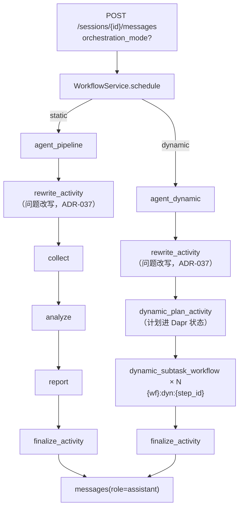
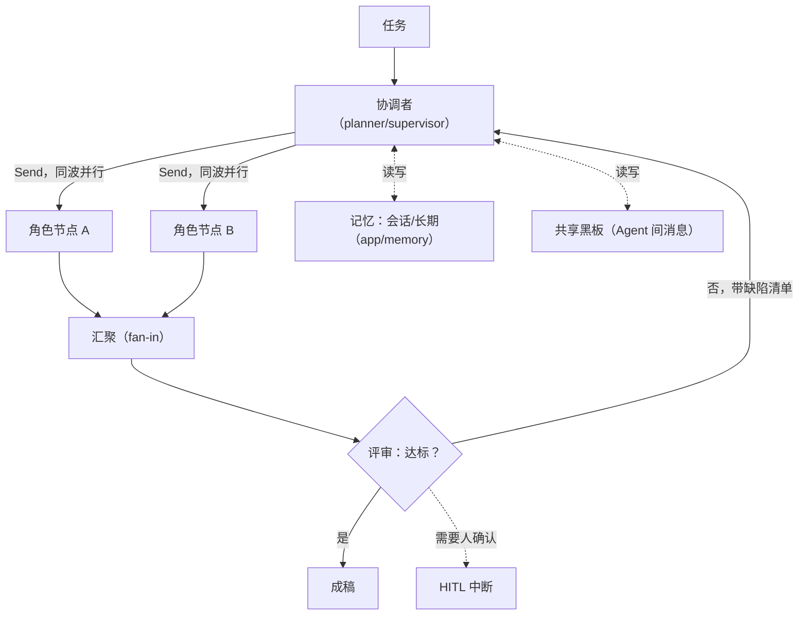

# 编排模式设计与演进

本文回答三件事：

1. 现在有哪两条编排链路，它们**各自保证什么**；
2. 动态链路怎么用、怎么降级、怎么在 Dapr 里持久化；
3. 「真·多智能体自主协作」要做什么、前置条件是什么、哪些地方会真的付代价。

决策记录：ADR-019（动态编排图）、ADR-038（自动编排升级：波次并行 / 合成 / 校验）、
ADR-018（视图职责）、ADR-009（工具契约）、ADR-007（阶段活动与 Ollama）。
设计事实源：`doc/15 AI Native多智能体协作平台.md` 模块 1。

---

## 1. 两条链路

| | **静态（`static`）** | **动态（`dynamic`，自动编排）** |
| --- | --- | --- |
| 拓扑 | `START → rewrite → collector → analyst → reporter → END` | `START → intake →（单 Agent 直答 \| planner → 波内并行 worker → 合成 → 校验）→ finalize → END` |
| 谁决定参与角色 | 代码里的 `PIPELINE_ROLE_ASSIGNMENT` | 规划节点（LLM）在运行期产出 |
| 前置步骤 | 问题改写（ADR-037） | **intake**：改写 + 意图识别合并成一次调用（ADR-038 §2） |
| 简单任务 | 一样走三步 | 意图判定 `need_multi_subtask=false` → **单 Agent 直答**（1 步，跳过编排/并行/合成/校验） |
| 状态类型 | `PipelineState`（`current_step` 单值指针） | `DynamicPipelineState`（无指针，靠 `results` 反推；并行分支按键合并） |
| 同一角色能否出现多次 | 不能 | 可以 |
| 依赖表达 | 隐式（下标 -1） | 显式 `depends_on` |
| 执行顺序 | 严格串行 | **按波并行**：同波无依赖的步骤一起派发，波间串行 |
| 单步失败的影响面 | 整条链失败 | 只连坐依赖它的步骤（含传递闭包）；有交付物则终态 `completed` + `partial` |
| 交付物 | reporter 阶段的正文 | 合成器的输出（有失败子任务时正文开头点名缺席项） |
| 结果校验 | 无 | 校验器判定是否满足原始意图；不达标最多重编排 1 轮 |
| Dapr 子工作流 ID | `{workflow_id}:{stage}` | `{workflow_id}:dyn:r{round}:{step_id}` |
| 逐节点轨迹 | `/stages` 全量可取 | `/stages` 按 `flow` 节点可取（升级前的旧执行仍返回 `not_integrated`） |
| 默认 | **是** | 否（需显式启用） |

两条链路**并列注册、并列存在**，共用同一套：

- **问题改写前置步骤**（`app/orchestration/rewrite.py`，ADR-037）——两条链路都在第一步之前跑它；
- 角色定义与 system prompt（`app/agents/roles.py`）；
- 工具契约与 ReAct 工具回填循环（`app/orchestration/tools.py`、`invoke_role_messages`）；
- 阶段观测（`app/observability/instrumentation.py::observed_stage`）；
- 终态回写活动（`app/workflows/pipeline.py::finalize_activity`）；
- 报告落库口径（ADR-008）。



### 1.1 问题改写（前置步骤）

用户的输入常常依赖上下文才有意义——「重试」「再详细一点」单独拿出来谁也看不懂，而下游拿到的是
**任务文本**，不是整段对话。所以两条链路都在第一步之前跑一次改写：把这一轮的话结合
会话历史、长期记忆与本轮附件**文件名**，补成一段自包含的任务（补全指代、写清目标与约束、
点明期望交付物）。

要点：

- 它**不是协作阶段**：没有角色、不产出交付物，因此**不新增第 4 个 `PipelineStage`**
  （那个三元组同时撑起 Dapr 子工作流 ID、阶段状态键、stage-trace 出参与前端阶段列表）；
- **增强而非必需**：模型没配好、调用失败、输出为空、跑偏成长文、原样抄回来——一律退回原文，
  `rewrite_source` 记 `original`，绝不阻塞执行（ADR-037 §1）；
- 模型解析走**平台节点**那一份（`PLANNER_AGENT_ID`）：使用者在「工具与配置」里配好的默认路由
  或给 planner 的绑定对改写同样生效——只看环境变量会得到"模型缺失"；
- 结果随 `workflow_runs.checkpoint` 落库（`rewritten_task` / `rewrite_source`），可审计。

---

## 2. 动态链路怎么跑

### 2.0 intake：改写 + 意图（一次调用）

动态链路的第一个活动是 **intake**（`app/orchestration/intake.py`）：一次平台模型调用同时产出
「改写后的任务」与结构化意图，输出要求是严格 JSON：

```json
{
  "rewritten_task": "对比 A 与 B 的实测数据，用中文出一份包含风险一节的报告",
  "intent": {
    "intent_type": "report",
    "user_goal": "对比两套方案并给出结论",
    "constraints": ["中文", "含风险一节"],
    "need_multi_subtask": true
  }
}
```

**分段降级**是这一层的核心：文本拿不到（调用失败 / 空 / 跑偏成长文）退原文并记
`rewrite_source=original`；意图拿不到（没吐 JSON / 字段不合法）置空并记
`intent_source=fallback`；两者互不牵连。旧口径「只输出任务正文」也照样工作——
文本照用、意图缺失，于是按多 Agent 处理。

**路由护栏**：只有意图解析成功且 `need_multi_subtask=false` 才走单 Agent 直答
（固定 1 步、角色 `reporter`、输入里显式标注「本次为单 Agent 直答」，并按 `constraints`
给出期望输出）。其余一切情况（包括解析失败、调用失败）都按多 Agent 处理——
「判不准就不要省这一步」。

### 2.1 计划与校验

规划节点的输入是（改写后的）用户任务 + 结构化意图（+ 重编排时的缺陷清单），
输出要求是**严格 JSON**：

```json
{
  "rationale": "任务需要两路事实核对后再成文，因此安排两次收集。",
  "steps": [
    { "id": "s1", "role": "collector", "instruction": "收集官方文档口径", "depends_on": [],
      "expected_output": "要点清单", "retry": 2, "timeout_seconds": 300 },
    { "id": "s2", "role": "collector", "instruction": "收集社区实测口径", "depends_on": [] },
    { "id": "s3", "role": "analyst",   "instruction": "对比两路口径，列出冲突点", "depends_on": ["s1", "s2"] },
    { "id": "s4", "role": "reporter",  "instruction": "生成最终报告", "depends_on": ["s3"] }
  ]
}
```

`parse_plan` 的接受条件（**全中才收，一处不合就整份丢弃**）：

| 规则 | 为什么 |
| --- | --- |
| 顶层是对象且 `steps` 非空 | 空计划等于没有计划 |
| 步骤数 ≤ `max_plan_steps`（默认 6） | 成本上限，也是「模型跑飞了」的熔断 |
| `role` ∈ `RoleId` | 未知角色没有 system prompt，跑不了 |
| `id` 非空且唯一 | `results` 的键 |
| `instruction` 非空 | 它是角色节点的用户输入 |
| `depends_on` 只引用**在它之前已声明**的 id | 一条规则同时排除自依赖、前向引用与环，不必另写环检测 |
| `retry` ∈ 0–3、`timeout_seconds` ∈ 30–900（可省略） | 越界同样整份丢弃：不修补半份计划；缺省即用服务端配置 |
| `expected_output` 可省略 | 给了就拼进该步的输入，让角色知道这一步的交付物形态 |

模型输出容错：Markdown 围栏、解释性前后缀、纯 JSON 都能解析（`_extract_json` 先试整体、
再试围栏内容、最后退化为「第一个 `{` 到最后一个 `}`」）。

### 2.2 降级

规划**失败不是错误，是回退**：

| 情形 | 结果 |
| --- | --- |
| 规划模型调用抛异常 | `fallback_plan("规划模型调用失败（…），回退到固定三步流水线。")` |
| 返回内容不是可用计划 | `fallback_plan("规划模型返回的内容不是可用计划，…")` |

回退计划与静态流水线同构（`collector → analyst → reporter`），因此**用户永远拿得到报告**，
只是失去了「按任务裁剪角色」的收益。`plan_source`（`llm` / `fallback`）与 `plan_rationale`
把这次到底是「规划过」还是「降级了」写进 `workflow_runs.checkpoint`，前端与日志都能看出来。

### 2.3 调度语义

- **就绪**：某步骤的 `depends_on` 全部 `completed`，且自身尚无结果。
- **并行**：由 `depends_on` 算层级（`waves()`，与前端 `levelOf()` 同一口径）：同波里彼此
  无依赖的步骤**一起派发**，等这一波全部返回才进下一波。并发上限是
  `AGENT_MAX_PARALLEL_WORKERS`（默认 3）：同波超过上限时按计划顺序切批，批间串行——
  闸门不会被绕过。
- **重试**：每步按 `retry`（缺省 `AGENT_SUBTASK_MAX_ATTEMPTS`）由 Dapr 重试**整个步骤活动**；
  重试是**子工作流里的一层显式循环**（每次尝试都是一个持久化活动调用，退避走
  `ctx.create_timer`）：Dapr 的重试策略不把「第几次」告诉工作流代码，而审计要的是
  **实际**尝试次数。重试耗尽后子工作流把失败收敛成 `failed` 业务结果返回，**不抛给父工作流**
  ——否则 `when_all` 会在第一个分支失败时提前结束，同波其它分支的产出一起丢掉。
  checkpoint 的 `plan[].attempts` 记实际次数，`retry` 记配置值，两列并排看。
- **失败**：该步记 `failed`，依赖它的步骤（含传递闭包）记 `skipped`，其余照常执行。
  只对**直接**依赖标 skipped 是不够的——`s3 → s2 → s1` 里 `s1` 失败时 `s3` 会一直停在
  `pending`，前端看起来像「还在排队」而不是「已经放弃」。
- **合成**：多 Agent 路径的最后一步是合成器（复用 `reporter` 角色 + 一段合成职责）：
  收集本轮所有可用子任务产出、冲突消解、去重、按约束成稿，**并在有失败子任务时于正文开头
  点名缺席项**。合成失败时退回最后一个成功子任务的产出（宁可给素材，也不把前面的成果丢掉）。
- **校验**：合成之后由校验器判定「满足原始意图吗」，输出 `{satisfied, defects[], missing[]}`。
  不达标且还有轮次预算（`AGENT_MAX_PLAN_ROUNDS`，硬上限 1）时，带缺陷清单**重编排一轮**：
  复用第一轮的 intake 结果、实例 ID 换到 `r2` 命名空间。校验器自己不可用时视为通过
  （`source=fallback`）——它不该因为自己坏了就推翻一份可用交付物。
- **终态**：有交付物即 `completed`（`final_output`），否则 `failed`；存在失败/跳过的子任务时
  终态仍是 `completed`，但 `partial=true` 且 `failed_steps` / `skipped_steps` 写明缺了什么，
  失败与跳过原因合并进 `error`。单 Agent 直答路径的交付物就是那一步的产出（没有合成步骤）。
- **成本闸门**：`AGENT_TOKEN_BUDGET`（默认 0 = 不限制）是单次执行的**累计 Token 上限**，
  口径为 intake + 规划 + 子任务（含重试）+ 合成 + 校验之和（重编排时第一轮的量带到第二轮）。
  用尽的处理是**收口而不是作废**：不再派发剩余子任务、不再开新一轮，但照常合成已完成的部分；
  剩余步骤记 `skipped` 并写明「Token 预算已用尽」，checkpoint 记
  `tokens_used` / `token_budget` / `budget_exceeded`。用量是**下限口径**
  （模型没回 usage 时按 0 计），且只来自活动结果——控制流不能依赖可观测采样那种进程内数据。
- **工具**：与静态链路同一套注册表与 ReAct 循环，观测标签用 `stage=dyn:{step_id}`、
  `role={角色}`——`stage` 用步骤 id 而不是阶段名，因为动态模式下一次执行可以有多个同角色步骤，
  按阶段名聚合会把它们混成一条。

### 2.4 Dapr 持久化映射

| 静态 | 动态 |
| --- | --- |
| 父 Workflow 顺序调三个固定阶段的子 Workflow | 父 Workflow 先调 **intake 活动**（改写 + 意图）、再调**规划活动**，然后**按波**并行调子 Workflow（`when_all`） |
| 阶段活动 `collect_activity` / `analyze_activity` / `report_activity` | `intake_activity` / `dynamic_plan_activity` / `dynamic_step_activity` / `dynamic_synthesize_activity` / `dynamic_validate_activity` / `dynamic_checkpoint_activity` |
| `{workflow_id}:{stage}` | `{workflow_id}:dyn:r{round}:{step_id}`（轮次进 ID：重编排的第二轮会有同名的 `s1`） |
| 终态回写 `finalize_activity` | **复用同一个活动**（检查点换成 `dynamic_checkpoint_summary`） |

三条硬约束：

1. **规划必须是一个活动**。规划结果进 Dapr 状态存储，重放时不会重新调用规划模型——否则
   恢复一次就得到一份新计划，续跑无从谈起。
2. **业务终态与 Dapr 终态保持一致**。没有交付物时父工作流以 `failed` 抛出，避免出现
   「工作流 `completed` 但消息 `failed`」（ADR-016 F-05 是同一类问题）。
3. **checkpoint 摘要由父工作流单点写**。并行的子工作流各自写**自己那一步**的状态键
   （`…:workflow:{workflow_id}:dyn:r{round}:{node_id}`），摘要在每批**前后**各刷一次：
   「正在跑哪一波」与「这一波跑完了」是两种状态。让并行子工作流都去写同一行摘要，
   后写的会把先写的盖掉。

**暂停/恢复的语义**因此是**波边界**：会话级 `pause` 交给 Dapr，当前正在跑的那一批子任务会
跑完当前活动，恢复后从下一批继续。跨进程恢复不受影响——实例 ID 与状态键都是稳定的。

### 2.5 启用方式

```bash
# 方式一：服务端（默认 static）
AGENT_ORCHESTRATION_MODE=dynamic      # 可选 static / dynamic
AGENT_MAX_PLAN_STEPS=6
AGENT_MAX_PARALLEL_WORKERS=3          # 同波并发上限（成本闸门）
AGENT_SUBTASK_MAX_ATTEMPTS=3          # 单步默认最大尝试次数（含首次）
AGENT_SUBTASK_TIMEOUT_SECONDS=300     # 单步模型调用超时
AGENT_VALIDATION_ENABLED=true         # 合成后是否跑校验（关掉即直接交付）
AGENT_MAX_PLAN_ROUNDS=1               # 校验不达标允许的重编排轮数（硬上限 1）
AGENT_TOKEN_BUDGET=0                  # 单次执行累计 Token 上限；0 = 不限制（默认）

# 方式二：单次请求覆盖（不改服务端配置）
curl -X POST .../sessions/{id}/messages \
  -H 'content-type: application/json' \
  -d '{"content":"对比两种方案的实测数据并出报告","orchestration_mode":"dynamic"}'
```

非法取值：请求体由 Pydantic `Literal` 拦成 `422`（**不静默退回 static**——「我选了动态」
却悄悄变成固定流程，比直接报错更难查）；服务端配置读到非法值时退回 `static`。

### 2.6 画布怎么消费计划

前端协作画布（ADR-018 / ADR-028）不认「拓扑」，只认 checkpoint 里的字段。
**并行与串行是算出来的，不是画死的**——这是「动态编排能被画出来」的全部依据：

| 字段 | 消费处 | 结果 |
| --- | --- | --- |
| `flow[]` | `collaboration.ts::buildCollaboration()` | 整条流程的节点清单（`kind ∈ intent / plan / worker / synthesize / validate`）；**优先读它**，读不到回落 `plan[]`，再回落静态三段 |
| `flow[].depends_on`（或 `plan[].depends_on`） | `collaboration.ts::levelOf()` | 无依赖 = 第 0 波；其余 = 「所有依赖里最深波次 + 1」 |
| 同波节点数 | `collaboration.ts::buildCollaboration()` | > 1 则该波标 `parallel`，画布横排并画「并行协作区」框 |
| 边的两端波次 | 同上 | 上游单节点 = `serial` 边；上游多节点 = 并行汇入 |
| `flow[].status` / `plan[].status` | `collaboration.ts::statusOf()` | `completed` / `running` / `pending` / `skipped`（**`skipped` 与 `pending` 语义相反**，不能合并） |
| `partial` / `failed_steps` / `skipped_steps` | `GraphCanvas.tsx` | 画布左上角一条「部分子任务未完成」黄标——终态是绿点，但结果是部分的，必须说出来 |
| `validation` | 同上 | 校验结论（不通过时校验节点标红，缺陷清单在轨迹里） |

静态链路的 `depends_on` 是一条链，算出来是三波各一个节点；动态计划扇出时，算出来就有并行波。
**画布没有「串行节点」的专有分支**，静态链路只是它的一种输入（[ADR-030](decisions/030-multi-agent-topology-support.md)）。

平台节点（意图 / 编排 / 合成 / 校验）与子任务节点在画布上分开画：前者用虚线圆边与
平台图标，且不显示「模型 · Token」（它们不是使用者在团队里配置的 Agent）。

逐节点详情走 `/stages`：动态链路现在返回 `availability=available`，`items` 按 `flow` 节点给出
输入 / 产出 / 工具调用（数据来自各自的状态键）。**升级前发起的执行没有 `flow`，仍按原样返回
`not_integrated`**——旧数据不会显示成一张空白详情。

---

## 3. 档 3：真·多智能体自主协作（设计草案）

ADR-038 把原「档 3」清单里的并行、聚合、反思循环与波次可视化做掉了，这里只保留
**仍未做**的部分，并写清各自的代价与前置条件。

### 3.1 目标形态



五件事，按依赖顺序：

1. **并行波次（fan-out / fan-in）**。LangGraph 的 `Send` 把同一波的就绪步骤分派到多个节点，
   汇聚节点等全部返回。前置：`DynamicPipelineState.results` 需要并发安全的合并语义
   （现在是「返回整份替换」，并行时必须改成 reducer 或按步骤键合并，否则后写的会覆盖先写的）。
2. **结果聚合**。同波结果不能只按顺序拼，要有一个**聚合策略**：拼接 / 投票 / 按角色权重合并 /
   让 LLM 归并。这一层决定「并行」是否真的比串行好，而不是把等待时间换成混乱。
3. **反思循环**。评审节点读交付物 + 验收标准，不达标就带着**具体缺陷清单**回到协调者，
   而不是无差别重跑。前置：需要**上限**（轮次与总 Token）与**收敛判据**，否则是烧钱循环。
4. **记忆接入**。`app/memory/` 目前只有 Protocol，历史消息既不落记忆也不回注 Prompt
   （`doc/roadmap.md` 记录为 F-06，仍未处置）。档 2 的步骤输入已经改成「按 `depends_on`
   标注上游」，档 3 要再往前一步：**注入会话历史与长期记忆**，并决定「注多少、怎么截断、
   怎么标注时间与来源」。
5. **Human-in-the-Loop**。Dapr Workflow 已有 `pause` / `resume`（§4.6/§4.7），但语义是
   「暂停整个实例」，不是「在某个决策点等人批准再继续」。真 HITL 需要外部事件
   （`ctx.wait_for_external_event`）+ 审批状态落库 + 前端的待办入口。
### 3.1 已落地（ADR-038）

| 原「档 3」项 | 落地形态 |
| --- | --- |
| 并行波次 | 同波 `when_all`（Dapr）/ `Send`（进程内 LangGraph），并发上限 `AGENT_MAX_PARALLEL_WORKERS` |
| `results` 合并语义 | `Annotated[dict, merge_results]` 按键合并——并行分支只返回自己那一步的增量 |
| 结果聚合 | 合成器节点：冲突消解 + 去重 + 按约束成稿 + **失败子任务显式告知** |
| 反思循环 | 校验节点 + **最多一轮**带缺陷重编排（`AGENT_MAX_PLAN_ROUNDS`，硬上限 1） |
| 成本闸门 | 并发上限 + 步数上限 + 轮次上限 + **累计 Token 预算**（`AGENT_TOKEN_BUDGET`，用尽即收口并如实告知缺口） |
| 重试可审计 | 子工作流显式循环重试，`plan[].attempts` 记**实际**尝试次数（不是配置值） |
| 记忆接入 | 会话历史与长期偏好在 ADR-019/036 之后已进提示词；intake / 规划 / 步骤 / 合成共用同一份口径 |
| 波次可视化 | 画布优先读 `checkpoint.flow`，平台节点与子任务分开画（视图本体沿用，只加 kind 与 `partial` 两种呈现） |

### 3.2 仍未做（各有前置条件）

- **每波回编排器重算下一批**（真自适应）。ADR-038 的选择是「一次出全 DAG、按波调度」，
  只在**校验不达标**这一个明确信号上重编排一轮；更频繁的重算要先解决
  「执行中改变计划如何与 Dapr 重放共存」。
- **Human-in-the-Loop**。会话级 `pause` / `resume` 的语义是「暂停整个实例」，
  不是「在某个决策点等人批准再继续」。真 HITL 需要外部事件
  （`ctx.wait_for_external_event`）+ 审批状态落库 + 前端待办入口。
- **共享黑板（Agent 间消息）**。当前 Agent 之间只通过「上游产出正文」传递；广播、投票、
  协商这类协作形态需要新的状态与消息层。

### 3.3 前置条件（不做会返工）

- **先有评测集**。`plan_source` 只能说明「有没有降级」，说明不了「动态是否比静态好」。
  要度量：完成率、端到端时延、Token、以及**动态相对静态的净收益**。
  - **首版已产出（2026-09-17）**：`scripts/orchestration_ab.py` 对 4 个任务跑静态/动态两条链路，
    量 token、调用次数、步骤数、交付物字符与「必备内容命中」，报告 `doc/evals/orchestration-ab.md`。
    它只是**小样本首版**：4 个任务、单轮采样、必备内容是弱判据。ADR-038 之后该脚本默认量到的
    已经是**新链路**（进程内镜像），要对比「升级前 / 升级后」得另起一份基准。
  - 顺带量到的环境约束：本机网关在连续请求下会节流（紧接着上次请求结束就发下一次必失败），
    两个评测脚本都做了「强制间隔 + 只对报错重试」，并把等待与模型纯耗时分开记——
    否则量到的是限流不是编排。见 `doc/testing.md` §4.5 第 6 条。
- **成本闸门优先于能力**。并行波次与反思循环都会放大 Token；ADR-038 已给出并发上限
  （默认 3）、步数上限与轮次上限（硬上限 1），**累计 token 预算仍未做**——它是下一层需要
  补的闸门，前置是按执行汇总采样。
- **可恢复性同口径**。任何「执行中改变计划」的机制都必须先定义「计划变更如何与 Dapr 重放
  共存」，否则故障恢复会拿到一份半新半旧的执行路径。ADR-038 的解法是把重编排做成**新轮次**
  （实例 ID 与状态键带 `r2`），而不是原地改计划。

### 3.4 不建议做的

- **不要为了并行而并行**。当前 10 并发会话的端到端 p50 是 16.54s（ADR-016），瓶颈在单次 LLM
  调用的 24–35s 量级；同一波的步骤若共享一个慢模型，并行省下的是等待，不是算力。
  ADR-038 因此把并发做成默认 3 的闸门，而不是「有多少放多少」。
- **不要把「要不要拆、要不要并行」暴露成用户选择**。ADR-018 的教训是：用户无法为「该由哪个
  Agent 主导」做出有依据的判断，提供一个自己不理解的选项比不提供更伤信任。路由与并行度由
  编排层决定。
